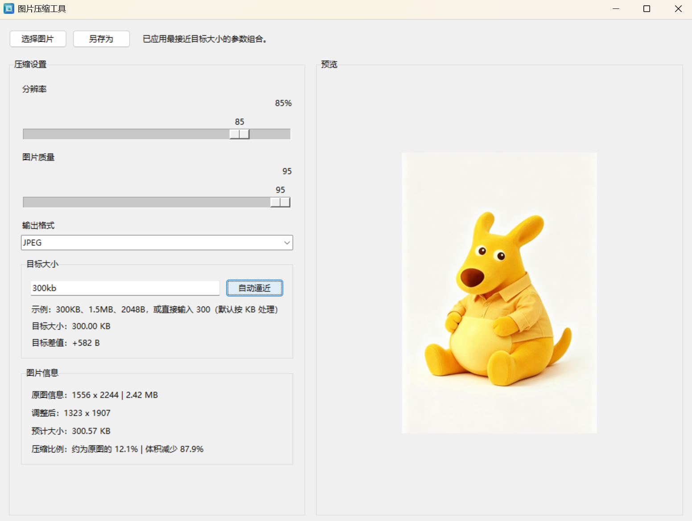

# 图片压缩工具

**完全本地处理，图片不上传任何服务器。** 直接输入目标体积（比如 `300KB`），自动找到最接近的分辨率和质量组合——不用反复拖滑块试。

> 📥 **[下载 ImageCompressor.exe](https://github.com/JiuYinl/Photocompressor/releases/latest)** —— 双击即用，无需安装 Python。

<!-- 截图放 assets/ 目录，用相对路径引用，例如：


-->

## 功能

- 打开一张本地图片，拖动滑块调整分辨率和质量
- 实时预览输出体积（基于真实内存编码，不是估算公式）
- 输入目标体积，支持 `300KB`、`1.5MB`、`2048B` 这类写法
- 一键自动匹配：反推最接近目标体积的参数组合
- 另存为 `JPEG` 或 `WEBP`

## 直接使用

到 [Releases](https://github.com/JiuYinl/Photocompressor/releases) 下载 `ImageCompressor.exe`，双击运行。仅支持 Windows。

## 从源码运行

```powershell
git clone https://github.com/JiuYinl/Photocompressor.git
cd Photocompressor
pip install pillow
python app.py
```

## 自己打包 exe

```powershell
cd Photocompressor
pip install pillow pyinstaller
python tools\generate_icon.py
python -m PyInstaller --clean ImageCompressor.spec
```

打包结果在 `dist\ImageCompressor.exe`。

## 环境要求

- Python 3.10+（代码用到 `dataclass(slots=True)`，3.10 起支持）
- Pillow
- tkinter（Windows 官方 Python 自带）
- PyInstaller（仅打包时需要）

## 许可证

[MIT](LICENSE)
